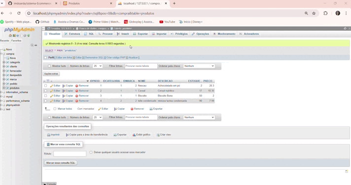

# ÍNDICE
 
* [Introdução](#introdu%C3%A7%C3%A3o)  
* [Tabelas](#tabelas-codificadas-no-banco-de-dados)
* [Funcionalidades](#funcionalidades)
* [Tecnologias Utilizadas](#tecnologias-utilizadas)  
* [Autores](#autores)  

 ## Introdução

  Este projeto é um sistema para o cadastro de produtos de um supermercado, desenvolvido para gerenciar as informações dos produtos em um banco de dados. O sistema permite a inclusão, visualização e gerenciamento de categorias e marcas, além de armazenar detalhes dos produtos, como nome, descrição, estoque, preço, categoria e marca.
  
  ``Veja abaixo o funcionamento do site: ``     

              

## Tabelas codificadas no banco de dados:

``TABELA PARA CATEGORIAS:``

      CREATE TABLE `categoria` (
      `IDCATEGORIA` int(11) NOT NULL AUTO_INCREMENT,
      `DESCRICAO` varchar(255) NOT NULL,
      PRIMARY KEY (`IDCATEGORIA`)
    ) ENGINE=InnoDB AUTO_INCREMENT=2 DEFAULT CHARSET=latin1;

``visualização dessa tabela: ``       

  

``TABELA PARA MARCA:``

    CREATE TABLE `marca` (
      `IDMARCA` int(11) NOT NULL AUTO_INCREMENT,
      `DESCRICAO` varchar(255) NOT NULL,
      PRIMARY KEY (`IDMARCA`)
    ) ENGINE=InnoDB AUTO_INCREMENT=4 DEFAULT CHARSET=latin1;

``visualização dessa tabela: ``      

   

  
``TABELA PARA PRODUTOS:``

     CREATE TABLE `produtos` (
      `IDPROD` int(10) NOT NULL AUTO_INCREMENT,
      `IDCATEGORIA` int(10) NOT NULL,
      `IDMARCA` int(10) NOT NULL,
      `NOME` varchar(255) NOT NULL,
      `DESCRICAO` varchar(255) NOT NULL,
       `ESTOQUE` int(10) NOT NULL,
      `PRECO` double NOT NULL,
      PRIMARY KEY (`IDPROD`,`IDCATEGORIA`,`IDMARCA`),
      KEY `IDCATEGORIA` (`IDCATEGORIA`),
      KEY `IDMARCA` (`IDMARCA`),
      CONSTRAINT `produtos_ibfk_1` FOREIGN KEY (`IDCATEGORIA`) REFERENCES `categoria` (`IDCATEGORIA`),
      CONSTRAINT `produtos_ibfk_2` FOREIGN KEY (`IDMARCA`) REFERENCES `marca` (`IDMARCA`)
    ) ENGINE=InnoDB AUTO_INCREMENT=4 DEFAULT CHARSET=latin1;

``visualização dessa tabela: ``        

   

## Funcionalidades:

* [``mysqli_query:``](https://www.php.net/manual/pt_BR/mysqli.query.php) Executa uma consulta no banco de dados.

   ``EXEMPLO: ``

       <?php

      mysqli_report(MYSQLI_REPORT_ERROR | MYSQLI_REPORT_STRICT);
      $mysqli = new mysqli("localhost", "my_user", "my_password", "world");

      /* Criar tabela não retorna um conjunto de resultados */
      $mysqli->query("CREATE TEMPORARY TABLE myCity LIKE City");
      printf("Tabela myCity criada com sucesso.\n");

      /* Consultas selecionadas retornam um conjunto de resultados */
      $result = $mysqli->query("SELECT Name FROM City LIMIT 10");
      printf("Select retornou %d linhas.\n", $result->num_rows);

      /* Se tivermos que recuperar uma grande quantidade de dados, usamos MYSQLI_USE_RESULT */
      $result = $mysqli->query("SELECT * FROM City", MYSQLI_USE_RESULT);

      /* Observe que não podemos executar nenhuma função que interaja com o
      servidor até que todos os registros tenham sido totalmente recuperados ou o resultado
      conjunto foi fechado. Todas as chamadas retornarão um erro 'fora de sincronia'*/
      $mysqli->query("SET @a:='isso não vai funcionar'");

  ``referência: https://www.php.net/manual/pt_BR/mysqli.query.php ``
  
* [``mysqli_error:``](https://www.php.net/manual/pt_BR/mysqli.error.php) Retorna uma string descrevendo o último erro.

    ``EXEMPLO: ``

      <?php
      //Creating a connection
      $con = mysqli_connect("localhost", "root", "password", "mydb");

      //Query to retrieve all the rows of employee table
      mysqli_query($con, "SELECT * FORM employee");

      //Error
      $error = mysqli_error($con);
      print("Error Occurred: ".$error);

      //Closing the connection
      mysqli_close($con);
      ?>

  ``referência: https://isolution.pro/pt/t/php/php-function-mysqli-error/funcao-php-mysqli-error``
  
* [``include:``](https://www.php.net/manual/pt_BR/function.include.php) A expressão include inclui e avalia o arquivo informado.

   ``EXEMPLO: ``

      <?php

      /* Este exemplo assume que www.exemplo.com.br está configurado para processar
      * arquivos .php e não arquivos .txt. Além disso, 'Funciona' aqui significa
      * que as variáveis $foo e $bar estão disponíveis dentro do arquivo incluído. */

      // Não vai funcionar; arquivo.txt não foi tratado por www.exemplo.com.br como PHP
      include 'http://www.exemplo.com.br/arquivo.txt?foo=1&bar=2';

      // Não vai funcionar; procura por um arquivo chamado 'arquivo.php?foo=1&bar=2' no
      // sistema de arquivos local.
      include 'arquivo.php?foo=1&bar=2';

      // Funciona.
      include 'http://www.exemplo.com.br/arquivo.php?foo=1&bar=2';
      ?>

  ``referência: https://www.php.net/manual/pt_BR/function.include.php``

  
* [``include_once:``](https://php.net/manual/pt_BR/function.include-once.php) inclui e avalia o arquivo informado durante a execução do script.  a única diferença entre ``include`` e ``include_once`` é que se o código do arquivo já foi incluído, não o fará novamente, e o ``include_once`` retornará true.

   ``EXEMPLO: ``

      <?php
       include_once 'header.php';
       echo "Conteúdo da página...";
       include_once 'footer.php';
      ?>

``referência: https://mundophp.com.br/explorando-as-diferencas-entre-include-require-include_once-e-require_once-em-php/``
  
* [``mysqli_close:``](https://www.php.net/manual/pt_BR/mysqli.close.php) Fecha uma conexão ao banco de dados previamente aberta.

   ``EXEMPLO: ``

       <?php

        mysqli_report(MYSQLI_REPORT_ERROR | MYSQLI_REPORT_STRICT);
        $mysqli = mysqli_connect("localhost", "meu_usuario", "minha_senha", "mundo");

       $result = mysqli_query($mysqli, "SELECT Nome, CodigoPais FROM Cidade ORDER BY ID LIMIT 3");

      /* Fecha a conexão assim que não for mais necessária */
      mysqli_close($mysqli);

      foreach ($result as $row) {
      /* Processando os dados obtidos do banco */
      }

  ``referência: https://www.php.net/manual/pt_BR/mysqli.close.php``
  
* [``mysqli_affected_rows:``](https://www.php.net/manual/en/mysqli.affected-rows.php) Retorna o número de linhas afetadas pela operação MySQL anterior

   ``EXEMPLO: ``

      <?php

      mysqli_report(MYSQLI_REPORT_ERROR | MYSQLI_REPORT_STRICT);
      $link = mysqli_connect("localhost", "my_user", "my_password", "world");

      /* Insert rows */
      mysqli_query($link, "CREATE TABLE Language SELECT * from CountryLanguage");
      printf("Affected rows (INSERT): %d\n", mysqli_affected_rows($link));

      mysqli_query($link, "ALTER TABLE Language ADD Status int default 0");

      /* update rows */
      mysqli_query($link, "UPDATE Language SET Status=1 WHERE Percentage > 50");
      printf("Affected rows (UPDATE): %d\n", mysqli_affected_rows($link));

      /* delete rows */
      mysqli_query($link, "DELETE FROM Language WHERE Percentage < 50");
      printf("Affected rows (DELETE): %d\n", mysqli_affected_rows($link));

      /* select all rows */
      $result = mysqli_query($link, "SELECT CountryCode FROM Language");
      printf("Affected rows (SELECT): %d\n", mysqli_affected_rows($link));

      /* Delete table Language */
      mysqli_query($link, "DROP TABLE Language");

  ``referência: https://www.php.net/manual/pt_BR/mysqli.affected-rows.php``
  
* [``EQUIV=REFRESH CONTENT:``](https://www.w3schools.com/tags/att_meta_http_equiv.asp) O http-equivatributo fornece um cabeçalho HTTP para as informações/valor do contentatributo. O http-equivatributo pode ser usado para simular um cabeçalho de resposta HTTP.

   ``EXEMPLO: ``

      <?php
       echo("<meta http-equiv='refresh' content='1'>");
       echo date('H:i:s Y-m-d');
      ?>

  ``referência: https://www.delftstack.com/pt/howto/php/php-refresh-page/#google_vignette``
  
  
* [``require_once:``´](https://www.php.net/manual/pt_BR/function.require-once.php) A expressão require_once é idêntica a require exceto que o PHP verificará se o arquivo já foi incluído, e em caso afirmativo, não o incluirá.

   ``EXEMPLO: ``

      <?php

      define('__ROOT__', dirname(dirname(__FILE__)));

      require_once(__ROOT__.'/config.php');

?>

``referência: https://www.php.net/manual/pt_BR/function.require-once.php``

* [``mysqli_connect:``](https://www.php.net/manual/pt_BR/function.mysqli-connect.php) Se o modo de exceção mysqli não estiver habilitado e uma conexão falhar, então mysqli_connect() retornará false ao invés de um objeto.

   ``EXEMPLO: ``

      <?php
      $con = mysqli_connect("localhost","my_user","my_password","my_db");

      // Check connection
      if (mysqli_connect_error()) {
      echo "Failed to connect to MySQL: " . mysqli_connect_error();
      exit();
      }
      ?>

``referência: https://www.w3schools.com/Php/func_mysqli_connect.asp``

* [``connect_error:``](https://www.php.net/manual/pt_BR/mysqli.connect-error.php) Retorna uma descrição do último erro de conexão

   ``EXEMPLO: ``

      <?php
      $mysqli = new mysqli("localhost","my_user","my_password","my_db");

      // Check connection
      if ($mysqli -> connect_error) {
      echo "Failed to connect to MySQL: " . $mysqli -> connect_error;
      exit();
      }
      ?>

``referência: https://www.w3schools.com/Php/func_mysqli_connect_error.asp``
  
* [``set_charset:``](https://www.php.net/manual/pt_BR/mysqli.set-charset.php) Esta é a maneira preferida de alterar o conjunto de caracteres.

   ``EXEMPLO: ``

      <?php

      mysqli_report(MYSQLI_REPORT_ERROR | MYSQLI_REPORT_STRICT);
      $mysqli = new mysqli("localhost", "my_user", "my_password", "test");

      printf("Conjunto de caracteres inicial: %s\n", $mysqli->character_set_name());

      /* alterar conjunto de caracteres para utf8mb4 */
      $mysqli->set_charset("utf8mb4");

      printf("Conjunto de caracteres atual: %s\n", $mysqli->character_set_name());

``referência: https://www.php.net/manual/pt_BR/mysqli.set-charset.php``

## Tecnologias Utilizadas

* 	``MySQL``
*   ``PHP 8.2``
*   ``HTML 5``
*   ``CSS3``
*   ``GIT HUB``
*   ``APACHE``
*   ``XAMPP``

## Autores

[ Maria Eduarda Mendes](https://github.com/imdoarda)
